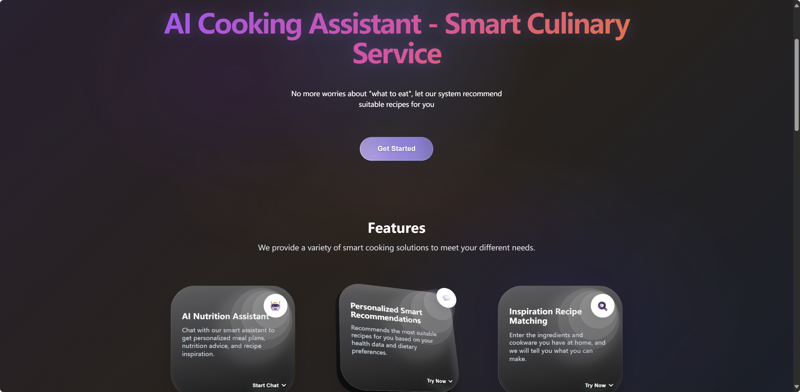
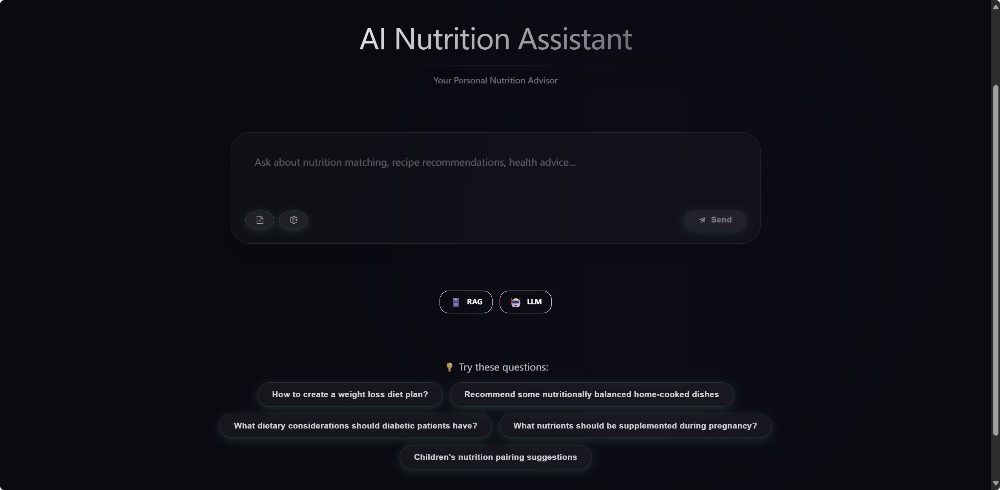
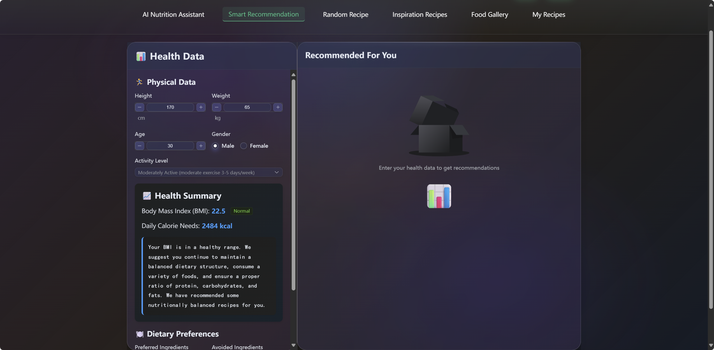
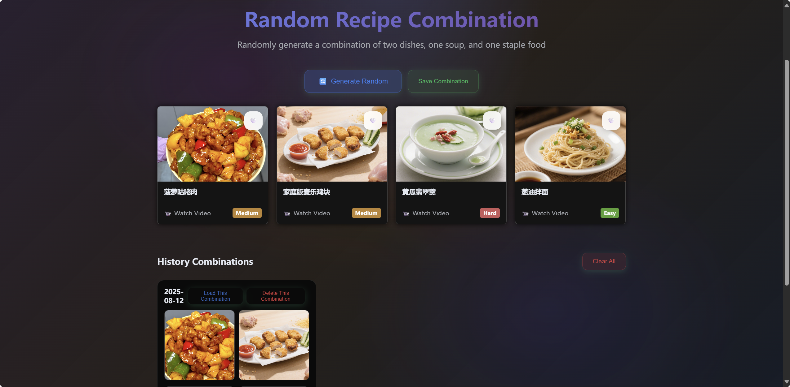
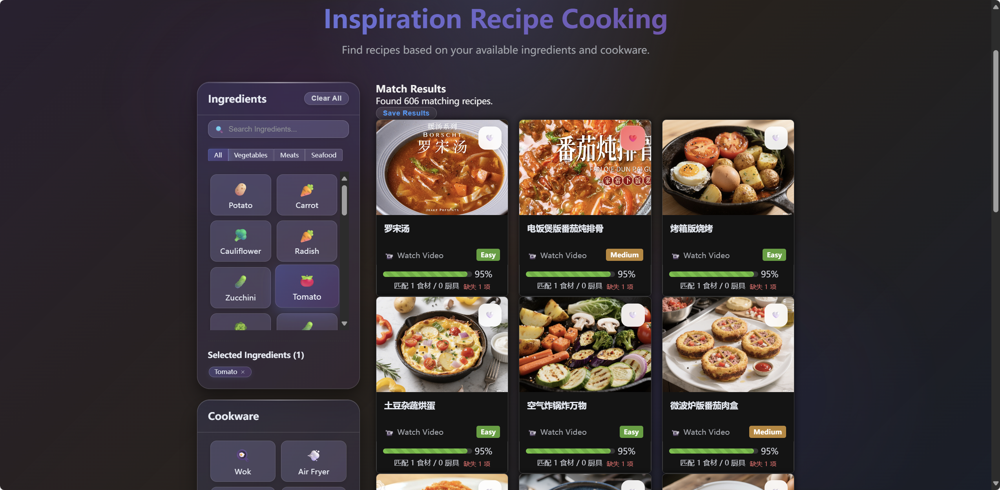
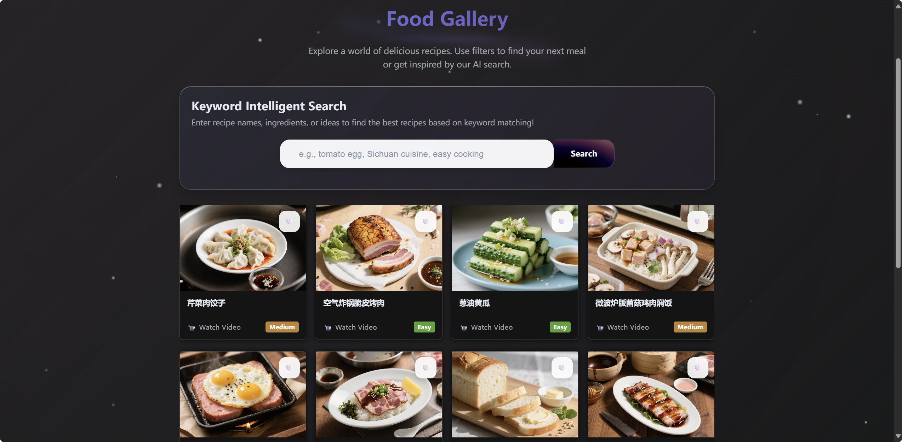

# AI-Cook & AI-Meal-Coach: 全栈双后端智能烹饪应用

[English](README.md) | [中文](README_zh.md)

---

这是一个功能全面的全栈 Web 应用，它通过一个统一的用户界面，提供了强大的菜谱搜索引擎和智能的 AI 膳食助手。本项目旨在成为一个集现代菜谱探索和个性化饮食规划于一体的AI烹饪助手应用。

## ✨ 核心功能

-   **统一的用户界面**: 所有功能，包括菜谱搜索和全新的 AI 膳食助手，都已集成到一个单一的、响应式的 Vue.js 前端中。
-   **双后端架构**: 应用运行两个独立的后端服务以处理专门任务：
    -   **AI 后端 (FastAPI)**: 一个用于个性化膳食计划和对话式 AI 的高性能服务，监听 `http://localhost:8000`。
    -   **搜索后端 (Flask)**: 一个集成了语义理解能力的混合搜索引擎，监听 `http://localhost:5001`。
-   **现代化的项目管理**:
    -   **单一依赖源**: 整个项目的 Python 依赖由根目录下的 `pyproject.toml` 文件统一管理，遵循现代 Python 标准（PEP 621），彻底解决了依赖冲突问题。
    -   **一键式启动脚本**: `firststart.bat` 和 `aicook.bat` 脚本简化了环境设置和日常开发流程。

## 📱 应用页面概览

应用包含8个主要页面，每个页面都专为特定的菜谱发现和管理功能而设计：

### 🏠 首页 (`/`)
应用的主要着陆页，展示功能特色和介绍。主要特性：


- **英雄区块**：引人注目的渐变标题和动画背景介绍
- **功能卡片**：交互式玻璃态卡片突出核心功能
- **菜谱轮播**：水平滚动展示热门菜谱
- **使用指南**：逐步引导如何使用应用
- **响应式设计**：适配所有设备尺寸，流畅动画效果

### 🤖 AI营养师 (`/ai-coach`)
智能营养教练，通过对话式AI提供个性化饮食建议。主要特性：


- **聊天界面**：与AI营养师的实时流式对话
- **健康分析**：BMI计算和个性化推荐
- **聊天历史**：持久化对话会话管理和搜索
- **多模型支持**：支持5种主流AI服务商（Google Gemini、OpenAI、豆包、智谱、DeepSeek）
- **智能RAG向量生成**：🧠 支持多种嵌入模型生成菜谱知识向量
- **动态服务商切换**：根据需要灵活切换AI服务提供商
- **向量数据管理**：可视化向量数据库状态和管理界面
- **服务状态监控**：后端服务实时健康监控

### 💡 AI推荐 (`/ai-recommend`)
基于用户健康数据和饮食偏好的个性化菜谱推荐。主要特性：


- **健康档案**：完整的身体指标表单（身高、体重、年龄、活动水平）
- **BMI&卡路里计算器**：自动健康指标计算和饮食建议
- **饮食偏好**：食材偏好、禁忌和饮食限制设置
- **智能推荐**：基于健康档案的菜谱推荐
- **过滤系统**：素食、纯素食、低糖等高级过滤
- **实时更新**：偏好变化时动态更新推荐

### 🎲 随机菜谱 (`/random-recipe`)
生成随机餐食组合，用于烹饪探索和膳食规划。主要特性：


- **随机餐食生成器**：创建均衡的多菜谱餐食组合
- **餐食历史**：保存和浏览之前生成的餐食组合
- **快捷操作**：一键生成餐食和保存到历史
- **轮播视图**：交互式历史浏览和菜谱预览
- **营养汇总**：餐食组合的综合营养信息
- **导出选项**：保存收藏的餐食组合以备将来参考

### 🔍 灵感菜谱 (`/limited-conditions`)
根据现有食材和厨房设备查找菜谱。主要特性：


- **食材选择**：浏览和选择分类食材数据库
- **设备匹配**：选择可用的厨房工具和炊具
- **智能搜索**：模糊、严格或生存模式匹配算法
- **实时过滤**：随选择变化即时更新菜谱
- **匹配分析**：详细匹配评分和缺失食材分析
- **类别过滤**：按类型（蔬菜、肉类、海鲜）组织食材
- **进度指示器**：菜谱兼容性的可视化反馈

### 🍽️ 美食展厅 (`/food-gallery`)
具有高级搜索功能的全面菜谱浏览器。主要特性：


- **AI智能搜索**：自然语言菜谱发现和语义理解
- **搜索分析**：搜索意图和提取特征的详细分解
- **菜谱网格**：响应式瀑布流布局和无限滚动
- **过滤系统**：按菜系、难度、烹饪时间高级过滤
- **粒子动画**：增强视觉吸引力的动态粒子效果
- **搜索建议**：AI生成的查询推荐
- **批量操作**：多选菜谱批量管理

### ⭐ 我的菜谱 (`/my-recipes`)
个人菜谱收藏管理，包括收藏和浏览历史。主要特性：
- **收藏管理**：精选偏好菜谱收藏
- **浏览历史**：菜谱交互的时间顺序记录
- **标签页界面**：收藏和历史之间轻松切换
- **批量操作**：清除历史和高效管理收藏
- **搜索集成**：快速访问从画廊添加更多菜谱
- **统计仪表板**：使用分析和偏好洞察
- **数据导出**：备份和分享个人菜谱收藏

### 📖 菜谱详情 (`/recipe/:id`)
具有交互功能的全面菜谱信息。主要特性：
- **完整菜谱信息**：食材、制作步骤、营养成分
- **视觉媒体**：高质量图片和可选视频链接
- **交互元素**：收藏切换、份量调整
- **营养分解**：详细的宏量和微量营养素信息
- **相关菜谱**：基于当前菜谱的AI精选推荐
- **厨房工具**：所需设备和炊具清单
- **响应式布局**：跨设备优化阅读体验
- **社交功能**：分享菜谱和跟踪烹饪进度

## 🧠 多模型RAG向量生成功能 

### 🎯 核心特性

我们的AI后端现已支持 **3 种主流AI服务商** 的向量嵌入生成，为您的菜谱知识库提供强大的语义搜索能力：

| AI服务商 | 聊天功能 | 向量生成 | 嵌入模型 | 特点 | 推荐场景 |
|---|---|---|---|---|---|
| **🌟 Google Gemini** | ✅ | ✅ | models/embedding-001 | 质量高、稳定性佳 | 主要推荐 |
| **🔥 OpenAI** | ✅ | ✅ | text-embedding-3-small | 兼容性好、效果优秀 | 国外用户首选 |
| **🎓 智谱 (ZhiPu)** | ✅ | ✅ | embedding-2 | 中文理解强、学术背景 | 中文内容优化 |
| **🇨🇳 豆包 (DouBao)** | ✅ | ❌ | 不支持 | 国内访问快、成本低 | 国内用户推荐 |
| **💰 DeepSeek** | ✅ | ❌ | 不支持 | 成本极低、推理能力强 | 大规模处理 |

> **⚠️ 注意**: DeepSeek R1 专注于推理功能，不支持向量生成。

### 🔧 智能配置系统

#### 环境变量配置
```bash
# 选择默认嵌入服务商
EMBEDDING_PROVIDER=google  # google, openai, doubao, zhipu, deepseek

# 各服务商API密钥
GOOGLE_API_KEY=your_google_api_key
OPENAI_API_KEY=your_openai_api_key  
DOUBAO_API_KEY=your_doubao_api_key
ZHIPU_API_KEY=your_zhipu_api_key
DEEPSEEK_API_KEY=your_deepseek_api_key

# 或使用通用默认密钥
DEFAULT_AI_API_KEY=your_default_key
```

#### 智能备选机制
- 🔄 **服务商故障自动切换**：主服务商失败时自动使用Google作为备选
- 🔐 **密钥验证**：自动检测API密钥有效性并提供配置建议
- 📊 **性能监控**：实时监控各服务商响应时间和成功率

### 🎛️ 前端配置界面

在AI营养师页面，点击设置按钮即可：

1. **选择AI服务商**：从5种服务商中自由选择
2. **输入API密钥**：安全的sessionStorage存储
3. **查看向量状态**：实时显示向量数据库状态
4. **一键生成向量**：支持Google/OpenAI一键生成17,000+菜谱向量
5. **切换服务商**：随时切换不同的嵌入模型

### 🚀 使用方法

#### 方法1：前端界面操作
1. 打开 AI营养师 页面 → 设置
2. 选择支持向量生成的服务商（Google/OpenAI/豆包/智谱）
3. 输入对应API密钥
4. 点击"生成向量数据"按钮

#### 方法2：API接口操作
```bash
# 查看支持的服务商
GET /api/v1/rag/providers

# 使用指定服务商重建向量
POST /api/v1/rag/rebuild-embeddings?provider=doubao&batch_size=100
```

#### 方法3：命令行操作
```bash
# 使用智谱重建向量（需配置API密钥）
python aire-backend/scripts/import_data.py rebuild --embedding-provider zhipu
```

---

## 🚀 开始使用

### 先决条件

-   **Python 3.9+**: 推荐使用 Python 3.9 或更高版本。
-   **Node.js & npm**: 前端构建和运行所需 (推荐 v18+)。

### 运行应用

#### 首次运行：耐心是关键

⚠️ **重要提示**: **首次运行过程准备时间较长，预计需要 5-15 分钟**，具体取决于您的网络状况和计算机性能。请务必保持稳定的网络连接，并耐心等待。这**仅需一次**，后续启动将非常迅速。

首次耗时主要在此阶段：
1.  **依赖包下载**: `firststart.bat` 会自动下载所有必需的 Python 和 Node.js 依赖包，总体积可能较大。


**操作步骤:**

1.  **确保环境纯净** (可选但推荐): 如果您之前运行过旧版本，请手动删除项目根目录下的 `.venv` 文件夹。
2.  **开始安装与启动**:
    -   在项目根目录找到并双击运行 `firststart.bat`。
    -   脚本将自动完成所有准备工作：创建虚拟环境、安装依赖、初始化数据库，并最终并行启动三个服务窗口。
3.  **等待完成**:
    -   请耐心等待所有命令行窗口中的任务执行完毕，特别是 **AI-Cook Search API** 窗口中的模型下载。
    -   成功后，脚本会自动在您的默认浏览器中打开 `http://localhost:3001`。

#### 日常启动：一键秒开

-   当您已经成功运行过一次 `firststart.bat` 之后，日常开发时只需双击运行根目录下的 `aicook.bat` 即可。
-   此脚本会跳过所有耗时的安装步骤，直接激活虚拟环境并启动全部服务，在几秒钟内完成。

## 🏗️ 设计思路与技术原理

### 1. 高层架构：统一依赖，双后端分离

本项目采用**双后端**架构，旨在实现关注点分离和技术栈优化，并通过**单一 `pyproject.toml`** 文件来确保整个项目环境的一致性和稳定性。

-   **AI 后端 (FastAPI)**: 负责处理计算密集型和I/O密集型的AI相关任务，如与大语言模型 (LLM) 的交互、用户个性化数据的复杂查询等。FastAPI 的异步特性使其成为处理并发AI请求的理想选择。
-   **搜索后端 (Flask)**: 专门用于高性能的本地菜谱搜索。Flask 轻量级的特性使其能够快速启动，并专注于文本索引和检索。
-   **统一依赖管理**: 根目录下的 `pyproject.toml` 是项目**唯一的**依赖来源，它整合了两个后端的所有需求，并遵循 PEP 621 标准。这从根本上解决了依赖冲突问题，使得环境创建和维护过程高度可靠。

### 2. 智能搜索后端 (Flask) 与混合搜索原理

搜索功能的设计采用了**混合搜索 (Hybrid Search)** 的思想，它结合了传统关键词搜索的精确性和现代语义搜索的智能性，以提供远超单一方法的搜索结果。

#### a. 检索阶段 (Retrieval): 多路召回

这是搜索的第一步，目标是从海量的菜谱数据中快速、准确地召回最相关的候选集。我们采用了**多路召回 (Multi-channel Recall)** 策略：

1.  **关键词匹配 (BM25)**: 一种经典的概率检索模型，它会考虑词频和逆文档频率，对包含搜索关键词的菜谱给予高分。
2.  **模糊匹配 (FuzzyWuzzy)**: 使用 `fuzzywuzzy` 库处理用户的拼写错误或近义词查询，提升容错性。
3.  **多模型语义向量检索 (Multi-Model Embeddings)**:
    -   **🧠 核心技术升级**: 系统现支持5种AI服务商的嵌入模型，不再局限于单一模型。可根据需要选择Google Gemini、OpenAI、豆包、智谱或DeepSeek的嵌入服务。
    -   **🔧 灵活索引构建**: 所有菜谱（菜名、标签、食材、制作步骤）都会被选定的AI模型转换成高维**向量（Embeddings）**。每个向量都是菜谱内容在数学空间中的精确表示。
    -   **🎯 智能相似度计算**: 查询通过相同的嵌入模型转换为向量，使用**FAISS向量数据库**进行高效的相似度搜索。支持动态切换嵌入模型以获得最佳搜索效果。
    -   **🔄 备选机制**: 如果主要服务商不可用，系统会智能切换到备选服务商，确保搜索功能的持续可用性。

#### b. 排序与融合 (Ranking & Fusion)

多路召回会产生几组不同的候选结果。系统会使用一种加权融合算法，综合考虑关键词匹配得分、语义相似度得分等多个维度，为每个候选菜谱计算一个最终的综合得分，然后进行排序，呈现给用户最相关的结果。

这种混合搜索的设计，有效地将传统搜索引擎的高效与精准，同AI语言模型的强大语义理解能力结合在了一起。

### 3. 项目结构 (现代化改造后)

```
/
├── .venv/                  # ➤ 全局 Python 虚拟环境
├── firststart.bat          # ➤ 首次安装并启动所有服务的脚本
├── aicook.bat              # ➤ 日常快速启动所有服务的脚本
├── pyproject.toml          # ➤ [核心] 项目唯一的Python依赖和配置源
│
├── aire-backend/           # │
│   └── app/                # │─ AI 后端核心应用 (FastAPI)
│
├── src/                    # 
│   ├── components/         # │─ Vue 可复用组件
│   ├── views/              # │─ Vue 页面级组件
│   └── backend/            # │
│       └── recipe_search_engine.py # │─ 搜索后端核心应用 (Flask)
│
├── recipes.json            # │─ 核心的菜谱数据文件
├── package.json            # │─ 前端项目元数据和依赖
└── README_zh.md            # └─ 本中文说明文件
```

## 致谢

本项目的初始灵感、设计思路以及部分菜谱数据来源于B站UP主**云游君**的开源项目 [**做饭吧！**](https://cook.yunyoujun.cn)。

在此基础上，本项目进行了全面的技术栈升级、架构重构和功能扩展，包括但不限于：
-   引入了AI的API自助填写、统一依赖、更新菜谱与图片。
-   整合了基于**混合搜索**思想的智能搜索引擎，融合了关键词与语义向量检索。
-   重构并简化了本地开发和部署流程。

对云游君的开源分享表示衷心的感谢！

## 联系我们：
[yunkun.syk@gmail.com](mailto:yunkun.syk@gmail.com)、[1411434312@qq.com](mailto:1411434312@qq.com)